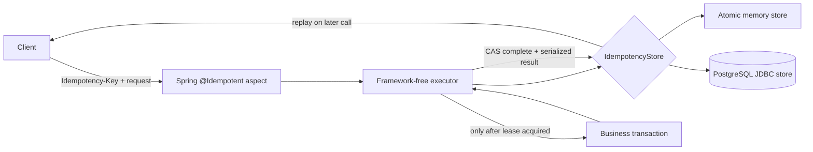

# Java Idempotency Kit

[](https://github.com/wasiliy-strecker/java-idempotency-kit/actions/workflows/verify.yml)
[](https://openjdk.org/projects/jdk/21/)
[](https://spring.io/projects/spring-boot)
[](LICENSE)

Production-minded idempotency for Java and Spring Boot. The kit coordinates concurrent requests, rejects key reuse for different work, stores successful results for replay, and makes its crash windows explicit.

```java
@Idempotent(
    namespace = "orders.create",
    key = "#idempotencyKey",
    fingerprint = "#request",
    resultVersion = "v1",
    failurePolicy = FailurePolicy.RETAIN)
@Transactional
public OrderResponse create(String idempotencyKey, CreateOrderRequest request) {
    return orderRepository.create(request);
}
```

The repository is both a reusable multi-module library and an executable architecture sample. It deliberately does **not** claim exactly-once execution.

## What happens for each request

| Existing state | Same fingerprint | Result |
|---|---:|---|
| No record | — | Acquire an exclusive lease and execute |
| Processing, live lease | Yes | Reject as in progress with a retry timestamp |
| Processing, expired lease | Yes | Atomically take over with a new owner token |
| Completed | Yes | Decode and return the stored result |
| Failed with `RETRY` | Yes | Acquire a new lease |
| Failed with `RETAIN` | Yes | Reject until retention expires |
| Any protected state | No | Reject as a key/fingerprint conflict |

Raw client keys and request bodies are never stored by the core. Keys and canonical request fingerprints are represented as SHA-256 digests. Result payloads are bounded and defensively copied.

## Architecture at a glance



The idempotency advice is ordered outside Spring transaction advice. This lets the business transaction commit before the result is marked complete, but it also creates an unavoidable crash window. See [guarantees and failure modes](docs/guarantees-and-failure-modes.md) for the exact semantics.

## Run the reference application

Requirements: Docker with Compose.

```bash
docker compose up --build
```

Create an order:

```bash
curl -i http://localhost:8080/api/orders \
  -H 'Content-Type: application/json' \
  -H 'Idempotency-Key: checkout-2026-0001' \
  -d '{
    "customerReference": "customer-42",
    "sku": "mechanical-keyboard",
    "quantity": 2,
    "unitPrice": 89.90
  }'
```

Send the same command again to receive the byte-equivalent logical result without another order insert. Change `quantity` while reusing the key to receive `409 Conflict`.

The example also exposes health and Micrometer endpoints under `/actuator`. More details are in the [order API guide](examples/order-api/README.md).

## Use the Spring Boot starter

The artifacts are not published yet. Install this checkout locally while the API is at `0.x`:

```bash
./mvnw install
```

```xml
<dependency>
  <groupId>io.github.wasiliy-strecker</groupId>
  <artifactId>idempotency-spring-boot-starter</artifactId>
  <version>0.1.0</version>
</dependency>
```

For PostgreSQL, include the bundled Flyway location alongside application migrations:

```yaml
spring:
  flyway:
    locations:
      - classpath:db/idempotency/postgresql
      - classpath:db/migration

idempotency-kit:
  store: jdbc
  retention: 24h
  lease: 30s
  max-result-bytes: 1048576
  cleanup:
    interval: 10m
    batch-size: 500
```

`jdbc` is the default and intentionally requires a `DataSource`. Select `idempotency-kit.store=memory` explicitly for tests or single-JVM deployments. A user-provided `IdempotencyStore` automatically replaces both built-in choices.

## Use the framework-free core

```java
IdempotencyCommand command = new IdempotencyCommand(
    IdempotencyKey.of("payments.charge", requestId),
    RequestFingerprint.sha256(canonicalRequestBytes),
    Duration.ofHours(24),
    Duration.ofSeconds(30),
    FailurePolicy.RETAIN);

IdempotencyResult<PaymentResult> result = executor.execute(
    command,
    paymentResultCodec,
    () -> paymentGateway.charge(payment));
```

Core has no framework or third-party runtime dependency. Custom stores can use the same contract suite shipped in `idempotency-testkit`.

## Modules

| Module | Responsibility |
|---|---|
| `idempotency-core` | State machine, safe identity model, executor, store SPI |
| `idempotency-testkit` | Reusable store conformance contract and deterministic clock |
| `idempotency-store-memory` | Lock-free, in-process atomic implementation |
| `idempotency-store-jdbc` | PostgreSQL row locking, leases, CAS transitions, cleanup, migration |
| `idempotency-spring-boot-autoconfigure` | SpEL annotation, typed Jackson replay, configuration, metrics |
| `idempotency-spring-boot-starter` | Consumer dependency with JDBC, AOP, and Jackson integration |
| `examples/order-api` | Runnable REST, validation, Flyway, transactions, Problem Details |

The deeper design is documented in [architecture](docs/architecture.md).

## Verification

```bash
# Java-only tests, formatting, Javadocs, and complete reactor packaging
./mvnw verify

# Mandatory PostgreSQL contracts and end-to-end HTTP tests
./mvnw -Pintegration verify
```

CI runs the unit reactor on Java 21 and Java 25. PostgreSQL tests use Testcontainers with PostgreSQL 18.3 and fail when Docker is unavailable rather than silently skipping guarantees.

## Guarantees, not slogans

The kit guarantees atomic ownership decisions within a correctly configured store and compare-and-set terminal transitions for the current lease owner. It cannot atomically combine an arbitrary business side effect with its own result record. Consumers must understand lease expiry, choose a failure policy, and make downstream effects idempotent when the business operation and the idempotency store do not share one atomic transaction.

Read the complete [guarantee matrix](docs/guarantees-and-failure-modes.md) before production use.

## Status

Version `0.1.0` is an initial API intended for evaluation. Compatibility is not promised until `1.0.0`. Contributions should preserve the shared store contract and the confidentiality rules in [SECURITY.md](SECURITY.md).
