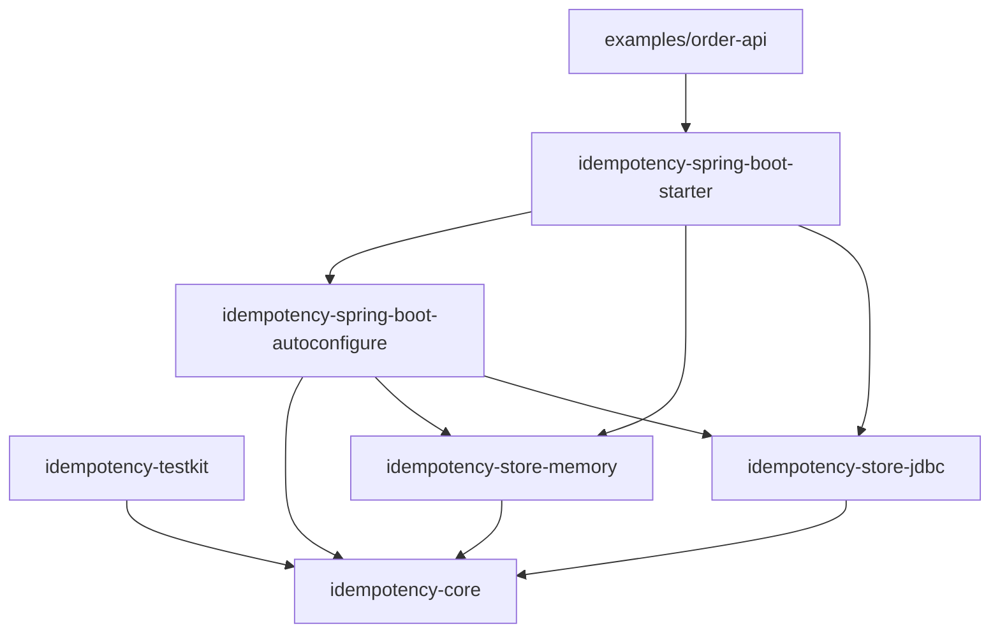
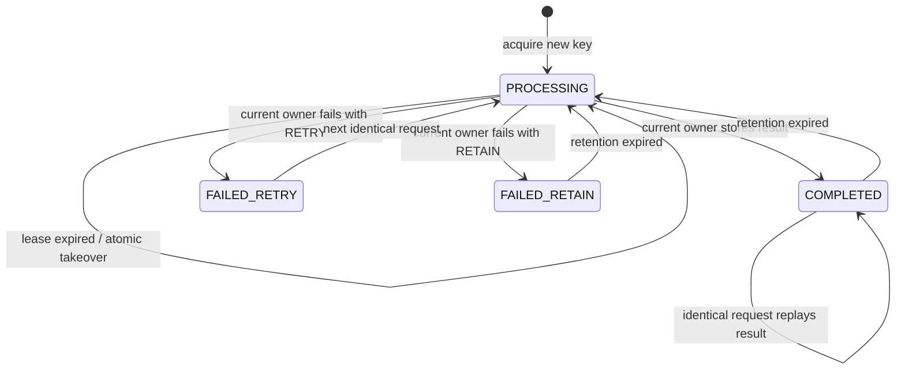
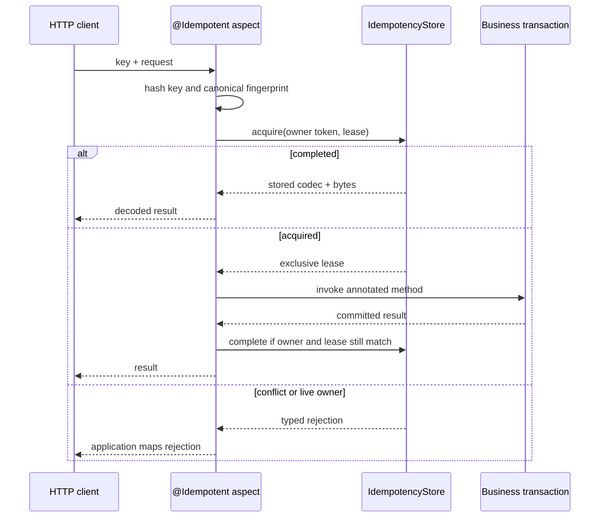

# Architecture

## Design goals

The library separates idempotency semantics from storage and framework integration:

- one explicit state machine across all stores;
- no Spring, JDBC, JSON, or logging dependency in core;
- atomic decisions delegated to each store implementation;
- no raw request keys or request payloads in persisted identity records;
- bounded result storage and bounded cleanup work;
- stable behavior that can be verified by a reusable contract suite.

## Module dependency direction

Store modules never depend on Spring. The example is a consumer, not a source of shared library behavior.

## State machine

At every protected state, a changed request fingerprint produces `Conflict`. A live `PROCESSING` lease produces `InProgress`. Terminal writes require the namespace, key digest, fingerprint, state, owner token, and a still-live lease to match.

## PostgreSQL acquisition

The JDBC adapter uses database time and a short transaction:

1. `INSERT ... ON CONFLICT DO NOTHING RETURNING` handles the common new-key path.
2. The existing-key path selects the row `FOR UPDATE`.
3. The locked row is evaluated for retention expiry, fingerprint conflict, state, and lease expiry.
4. A takeover replaces the owner token and deadlines in the same transaction.
5. The transaction commits before business code runs.

Completion and failure are single guarded `UPDATE` statements. A stale owner updates zero rows and receives `LostOwnershipException`. Cleanup selects a bounded batch with `FOR UPDATE SKIP LOCKED`, so concurrent cleanup workers do not serialize the whole table.

The schema also enforces valid shapes for processing, completed, and failed records with a database check constraint.

## Spring invocation flow

The aspect is ordered ahead of transaction advice. It supports synchronous, non-void methods. Spring proxy limitations still apply: self-invocation is not intercepted, and final methods/classes cannot use class-based proxies.

## Result compatibility

Spring results are serialized with the application `ObjectMapper`. The stored codec identifier includes a SHA-256 digest of the declared generic return type and the annotation's explicit `resultVersion`. Changing the return type or incrementing `resultVersion` while old records remain produces `ResultCodecMismatchException` instead of attempting an unsafe decode.

For long-lived public APIs, introduce explicit versioned DTO return types, increment `resultVersion` before incompatible field changes, and coordinate schema evolution with the configured retention period.

## Observability

Micrometer records operation counts and durations with two bounded tags:

- `namespace`: the static annotation namespace;
- `outcome`: `executed`, `replayed`, `in_progress`, `conflict`, `previous_failure`, or `error`.

Raw keys, digest values, request bodies, result bodies, and exception messages are not meter tags.
